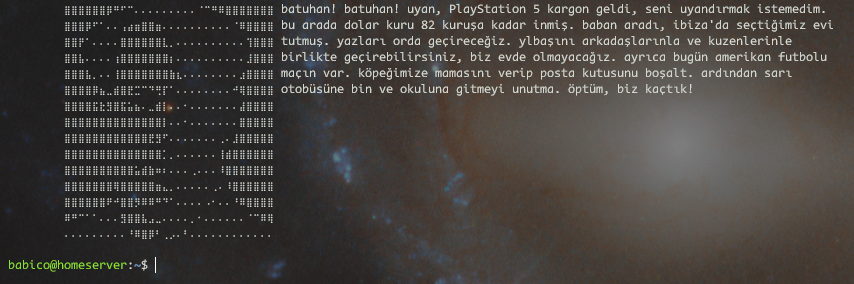
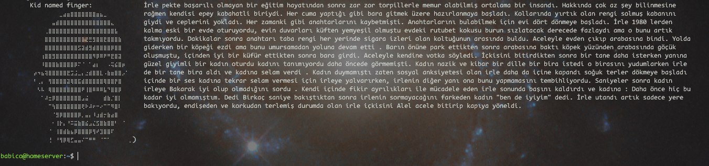
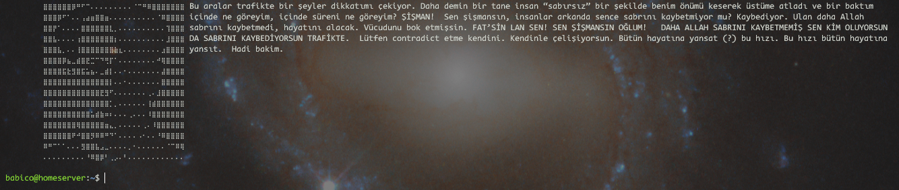

# Kopyamakarna Banner
Terminalin monotonluğundan bıktınız mı?
Tam size göre.
## Examples:



## How to setup:
**TERMİNALİNİZİN BRAILLE KARAKTERLERİNİN YAZDIRILMASINI DESTEKLEMESİ GEREKMEKTEDİR**

**Daha hızlı çalışmasını sağlamak için küçültülmüş sürümü kullanabilirsiniz.**

Gerekli kütüphaneleri yükleyin
```
pip install requests
```
Ardından, bunu ana dizininizde bulunan .bashrc dosyanıza eklemeniz yeterlidir:
```
python BANNER_LOCATION/banner.py
```
BANNER_LOCATION'ı bu komut dosyasını saklamak istediğiniz yerle değiştirin.

Ve bitti :p
